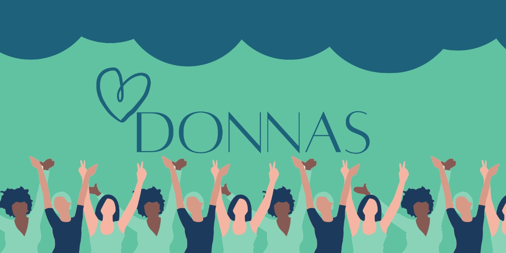
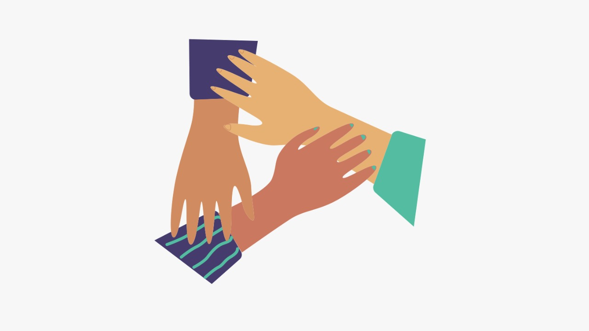

# Hackatona | ADE SAMPA

#### **A TECNOLOGIA E O DESENVOLVIMENTO DE POLÍTICAS PÚBLICAS PARA AS MULHERES**

Nos dias atuais as mulheres ainda encontram problemas estruturais, antigos e novos, que dificultam a busca por igualdade social em todos os aspectos. Apesar da popularização dos debates sobre a igualdade de gêneros, o feminismo e o combate ao machismo, ainda é comum ler e ouvir relatos sobre desigualdades salariais, violência sexual, feminicídio, baixa representatividade política, entre outros.
  

#### **EQUIPE 490 - DONNAS**
##### **DESIGNERS:** [**Karina Martins Vieira**](https://www.linkedin.com/in/karinamartinsv/)
##### **MARKETING:** [**Ana Maria da Silva de Jesus**](https://www.linkedin.com/in/ana-maria-aa350b222/) e [**Débora dos Santos da Paixão Freitas**](https://www.linkedin.com/in/débora-paixão-freitas-65317b216)
##### **DESENVOLVEDORA:** [**Mariana Gondin Peres**](https://www.linkedin.com/in/marianagondin/)

  

#### **QUEM ESTÁ PROPONDO ESSE DESAFIO?**
A ADE SAMPA – Agência São Paulo de Desenvolvimento – vem para fortalecer e apoiar as pessoas que têm, ou querem abrir, um negócio nas periferias da cidade de São Paulo. Seu objetivo é atender e acompanhar esses empreendedores desde o início de sua jornada.

_A Hackatona é uma iniciativa da Prefeitura da Cidade de São Paulo, por meio da Secretaria Municipal de Desenvolvimento Econômico, Trabalho e Turismo, intermédio da ADE SAMPA; com patrocínio da AWS, Uber Brasil e Buser. O apoio do programa Tem Saída, Dasa, Cronapp, Marisa, IFood, Laboratório Salomão Zoppi e produção da Comunidade Hackathon Brasil._

  

#### **SOBRE O PROJETO 'DONNAS'**
Donnas é um aplicativo de consulta clínica online gratuita, composta por profissionais voluntárias, voltado para mulheres , ***cis e trans***, que necessitam de atendimento e cuidado físico, mental e materno.

A plataforma necessitará de acesso a um banco de dados para cadastro dos clientes e profissionais, publicação de fóruns e um método de videoconferência para realização de consultas online. Para isso, é necessário a estruturação de uma equipe de tecnologia e a disponibilização voluntaria de profissionais da saúde (exclusivamente mulheres) qualificadas nos seguimentos de foco da plataforma (saúde sexual, hormonal e psicológica).

  

#### **HÁ SOLUÇÕES SIMILARES NO MERCADO? QUAIS?**
Alice, Vibe e Zenklub são soluções similares no mercado. Utilizamos o Zenklub como referência no modelo fácil e interativo de marcação de consultas.

  

#### **O GRANDE DIFERENCIAL**
Nosso grande diferencial é ser uma plataforma gratuita, mais interativa e exclusiva para mulheres.

  

#### **POSSÍVEIS IMPACTOS**
O impacto está na informação de qualidade chegando ao maior número possível de mulheres da cidade de São Paulo, por meio de uma plataforma de maior engajamento e interatividade, podendo gerar mais conhecimento na população feminina sobre questões próprias de saúde, levando ao diagnóstico de patologias mais precocemente, maior conscientização sobre assuntos que são um tabu (como a saúde mental) e ocasionando um “efeito dominó”, pois mulheres com mais saúde por mais tempo podem trabalhar melhor, realizar outras atividades com mais disposição e, é claro, informar melhor outras mulheres.

